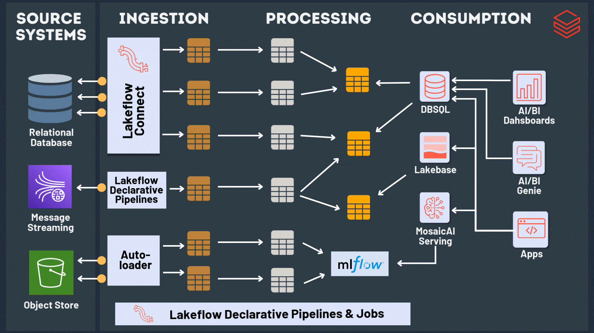

# databricks-insurance-claims-analytics
## Project Architecture

This project follows the Databricks Lakehouse architecture with Bronze, Silver, and Gold layers.

- **Bronze Layer** – Raw data ingestion from AWS Kinesis, SQL databases, and S3.
- **Silver Layer** – Data cleaning, transformations, and data quality checks using PySpark.
- **Gold Layer** – Aggregated datasets used for analytics dashboards and reporting.

## Tech Stack

- Databricks
- PySpark
- Delta Lake
- AWS Kinesis
- Databricks Autoloader
- Unity Catalog
- SQL
- Deep Learning (ResNet)

## Data Pipeline Workflow

1. Real-time telematics data ingested using AWS Kinesis.
2. Relational data loaded from SQL Server.
3. Image files processed from Amazon S3 using Databricks Autoloader.
4. Data processed through Bronze, Silver, and Gold layers.
5. Machine learning model classifies accident severity.
6. Business rules engine supports automated claims processing.
7. SQL dashboards provide analytics for investigators.

## Project Demo

## Key Features

- Real-time data ingestion using AWS Kinesis
- Automated file ingestion using Databricks Autoloader
- Bronze–Silver–Gold Lakehouse architecture
- Data quality validation in pipelines
- Deep learning model for accident severity classification
- Automated claims processing using rules engine
- Interactive analytics dashboards using SQL
